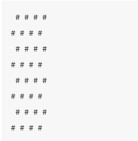

# ♡ P  R  E  A  D  M I S I Ó N ♡

Ejercicios realizados para la pre admisión a Laboratoria en 2017.

 ## Objetivos
Entender, a través de casos prácticos, cómo aplicar los conceptos de estructuras condicionales y estructuras repetitivas para la resolución de problemas

  1.FizzBuzz

 Escribe un programa que use console.log para imprimir todos los números del 1 al 100, con dos excepciones:

 Para números divisibles por 3, imprime "Fizz" en vez del número
 Para números divisibles por 5 (pero no por 3), imprime "Buzz".
 Cuando tengas eso funcionando, modifica tu programa para imprimir "FizzBuzz" para los números que sean divisibles tanto por 3 como por 5 (y que siga imprimiendo "Fizz" o "Buzz" para números divisibles por sólo uno de ellos).

 2.Tablero de Ajedrez
 Crea un programa que cree un string que represente una cuadrícula de 8x8, usando el salto de línea como separador. En cada posición de la cuadrícula debe haber un espacio o un carácter "#". Los caracteres deberían formar un tablero de ajedrez.

 Pasar ese string a console.log debería mostrar algo como esto:

 Cuando tengas un programa que genere este patrón, define una variable size = 8 y cambia el programa de tal manera que trabaje para cualquier tamaño, que sea proporcionado por un prompt() produciendo una cuadrícula del ancho y alto dado.

 3.Funciones matemáticas

 Crea dos funciones, add y multiply. Cada una debe tomar dos argumentos. La función add debe sumar sus argumentos y devolver el resultado. La funcion multiply debe multiplicar sus argumentos. Usando solamente estas dos funciones, resuelva este simple problema matemático: 36325 * (9824 + 777).

 4.Ordenando comida

 Imagina que estás pidiendo comida en un restaurante. Tu plato favorito es ceviche, así que lo elegirías si está en el menú. Si no hay ceviche, elegirías tacos al pastor. Si eso no está, te irías por empanada chilena. En el caso raro que ninguna de esas opciones esté disponible, te irías por una hamburguesa. Escribe una función, que de acuerdo a la disponibilidad de los platos en el menú, decidas qué ordenar.

 5.Edades y etapas

 Crea una web que pida, por medio de un prompt(), la edad de una persona, en años. Dependiendo del número brindado, la web debe dar un mensaje que clasifica a la persona en: toddler, preschooler, gradeschooler, teenager, young adult and adult, según el criterio de esta página.

 Si la persona ingresa un dato que no es un número entero (por ejemplo: un string, un número decimal, un cero, o un campo vacío), la web debe dar un mensaje de error. Revisa este link que tiene un par de tips interesantes relacionados a este proyecto.

 6.Contando caracteres y espacios
 Crea una web que pida, por medio de un prompt(), una frase al usuario. La web debe presentar un mensaje que diga: el número de caracteres y de espacios que componen el string ingresado. En la consola, debe aparecer cada caracter impreso en una línea separada, en mayúscula. Si el usuario ingresa un campo vacío, la web debe dar un mensaje de error.

 Arma tu archivo JavaScript para que tenga 3 funciones:

 * Una función que imprima todos los caracteres de un string, cada uno en una línea separada, en mayúscula.
 * Una función que cuente el número de caracteres de un string (¡sin utilizar .length!)
 * Una función que cuente el número de espacios de un string
